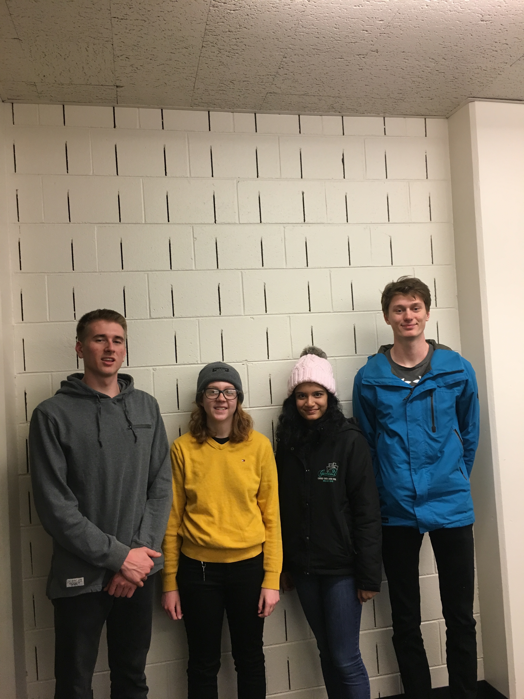
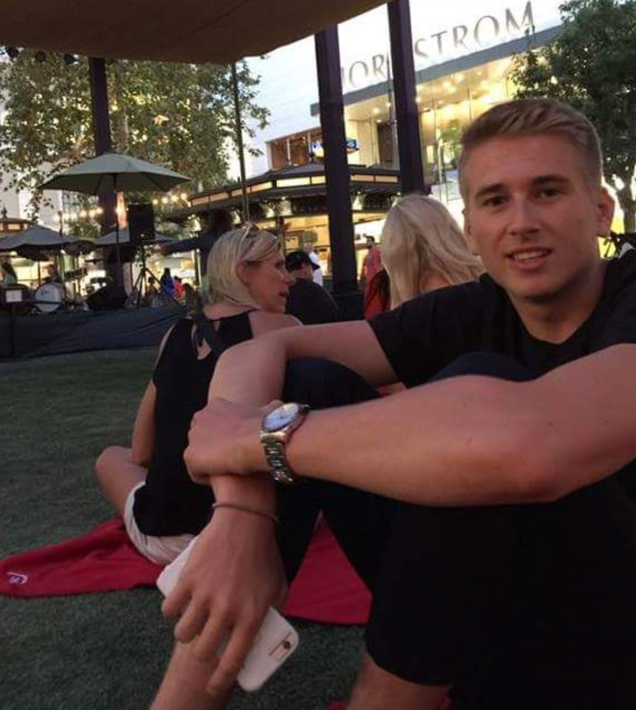

```{r setup, include=FALSE}
knitr::opts_chunk$set(echo = TRUE)
```

## GROUP SECTION

Group Name: Bumblebee

Group Goals: Learning to use R, applying statistics to real world problems, and learning how to use GitHub

{width=350px}


## INDIVIDUAL SECTION -

## William Brickowski

{width=350px}

Question I would analyze data to answer: I am currently pursuing a certificate in quantitative finance through the Leeds School of Business. I am quite interested in the financial markets and am interested in analyzing data on various portoflios with respect to market conditions in order to analyze how various factors affect portfolio returns.

Six months after graduation: I would like to begin my career as a trader working for a firm that employs quantitative and algorithmic strategies. 

Five years after graduation: I would like to be in the place where I can be own my own business, perhaps start my own fund.

Greatest career accompishment: I interned with Franklin Templeton Investments last summer which was a major stepping stone in the progression of my career.

In this course: In this course I hope to learn how to use GitHub efficiently, learning how to work with my team, and apply interesting data analysis methods.

Fun fact: I grew up in Doha, Qatar!

## Brady Kiesling

{width=350px}

My name is Brady Kiesling and I am from the Bay Area. One question I would want to answer by analyzing is a theory that punting in football is never a good idea. Some high-school coaches have theorized that always going for it on 4th down is the better option, but I want to know if this is true and at what levels of football. Six months after graduation, I would like to see myself starting grad school after taking some time off to do some traveling. 5 years after I graduate I would ideally like have a stable job, so I can pay back loans and afford to do the things I love, like skiing and playing golf. My greatest career accomplishment would be to build up enough trust in a company, where I can work remotely the majority of the time. In this course, I would like to learn how to properly format and interpret data using R and I would like to learn good teamwork skills. One thing you may not know about me is that I am really into improv theater and try to go to shows as much as possible. Unfortunately I was unable to continue Improv in college due to time constraints. 

## Rachael Robinson


Question I would analyze data to answer: I am interested to know how closely standardized test scores like the ACT correspond to graduating GPA in college.

Six months after graduation: Six months after graduating, I hope to have a job in industry. Ideally, I am using statistical reasoning and modeling to answer questions at my job.

Five years after graduation: Five years after graduation, I would like to be integrating the disciplines of writing and mathematics. Five years after graduation, I would like to be writing about statistical methodology and how it affects our perception of numbers.

Greatest career accomplishment: My biggest career goal is to have my scientific writing appear in a major journal or publication.

In this course: In order to reach my larger goals, I hope I learn how to code in R effectively and cogently in this course. This will allow me to create statistical models and answer questions I am likely to encounter on the job. Learning how to code cleanly will allow me to collaborate with other data scientists.

Fun fact: I have an unusually large cat named Salad.

# Manasi Raol
{width=350px}

* A question I would like to more about that could be answered by analying data is how the number of women in STEM has increased in the past twenty years, what the reasons behind it are, and how the data will change in the future.

* Six months after graduation, I want to be in grad school working on getting my masters' degree in Applied Math and doing research related to Biomedical Engineering since that's my area of emphasis.

* Five years after that, I want to be working in Applied Math, hopefully in the biomedical engineering field. I don't know exactly what I want to do yet, but hopefully I get to be invlolved in the design process when it comes to manufacturing certain biomedical products.

* I hope my greatest career accomplishment somehow benefits the greater good. I've always loved helping people and I love getting the opportunity to give people that are in need the opportunity to live a better life. Hopefully, I get to collaborate on some sort of biomedical project that benefits a group of people in the long run.

* In this course, I hope to learn how to use R successfully and learn to analyze data effectively. I want to be able to better understand statistics and trends.

* Something interesting about me is that I love music and it is a huge part of my life. I've been playing piano for almost 14 years and I did choir all throughout high school. I was in an auditioned women's choir for 2 years and in those two years we took a tour to New York and sang in Carnegie Hall as well as toured a bunch of cities in Ireland.

#Feedback From Manasi

* William: It's really cool that you got to intern with a company like that! However, I think the assignment was asking what you hope your biggest career accomplishment will be, as in something that hasn't happened yet but may happen in the future. Overall, you explained your career goals very well.

* Brady: You did a good job explaining what you want to learn about football through data analysis. You also your goalsl well. You noted that you want a stable job in five years so my question is do you have an idea of what job specifically or what field?

*Rachael: It's really interesting how you want to combine mathematics and writing. This may be just a typo or a misunderstanding on my part, but you have 2 sentences beginning with five years after gradutation. I just wanted to know if you wanted to do both those things or if you meant to say something else?

#Feedback From William

* Brady: I think your interest in applying data science to making decisions in sports is fascinated, and I feel like that is going to be a big area for potential jobs! That's super cool that you are into theater, I took a class in high school and really enjoy it. Looking forward to a good semester.

* Rachael: Your interest in whether or not high test scores correlate to graduating is really interest. I have always thought that they don't, but would really like to hear about your research on the subject. Does your cat eat salad? And if so, how did it manage to get so big! Looking forward to a good semester.

* Manasi: The biodmedical field is super interesting, and I think you are doing the right thing to learn about data science because it will undoubetly be very useful when applied to the field of study. I think it is great that more and more women are joining the STEM field and have also wondered why there haven't been many women in the past. That is super awesome that you play piano and sing; I for one have no musical talent. Looking forward to a good semester. 

# Feedback from Rachael

* William: Your experience and interest in quantitative finance is really interesting. For the question section, you might benefit from a little more contextualization on the terminology. Using colloquial or simplified terms could help a non-business oriented audience. I like your fun fact!

* Brady: This was a really comprehensive introduction to you and your interests. You might consider translating the answers to the questions into a bulleted or numbered form to make it a little bit easier to read. Your question about football made me curious too! I hope you can pursue that someday.

* Manasi: I loved your research question because I think it's very topical in a shifting environment. I think your goal of helping people is totally righteous, but you might benefit from a little bit more specificity in your response. You mentioned design as an area of interest in the biomedical field. Could that be part of how you help people? Your history with music is so interesting and cool!

