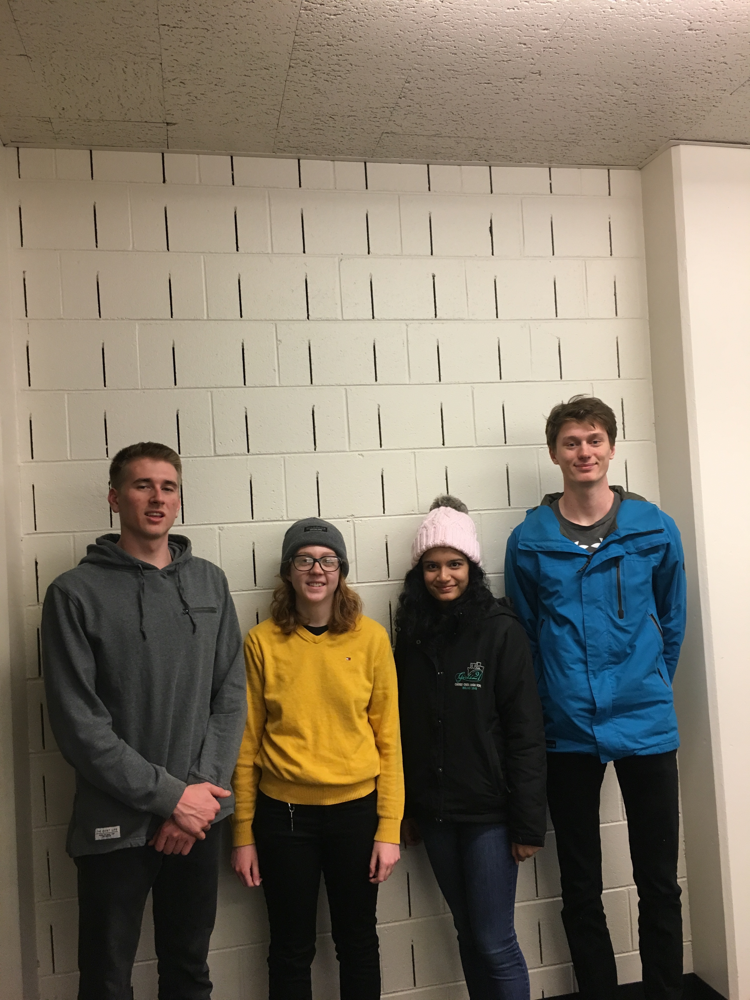

```{r setup, include=FALSE}
knitr::opts_chunk$set(echo = TRUE)
```

TEAM SECTION

Team Name: Bumblebee 

Team’s main goal: To learn how to use R, apply data science techniques, and learn how to cohesively utilize GitHub

{width=250px}


